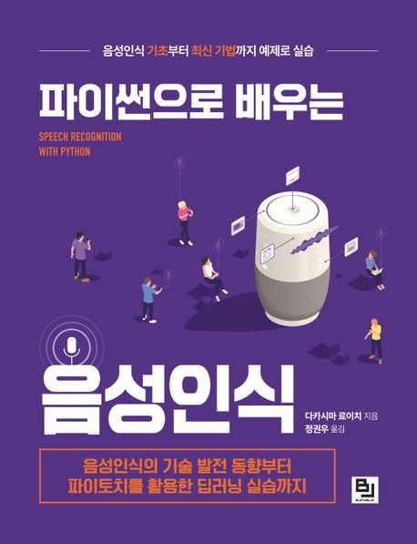

  
<h1 align="center">
  
파이썬으로 배우는 음성 인식

  
</h1>
  
<b>다카시마 료이치 저 · 정권우 역</b> 
비제이퍼블릭 · 2023년 1월 9일 출시 
[[github](https://github.com/bjpublic/python_speech_recognition)]</b> 

## :bulb: 목표

- **음성인식 기술을 공부한다.**

  > 음성인식 기술의 전체적인 흐름과 특징을 이해한다.

 

## 🚩 정리한 문서 목록

### 🏷 음성인식 기초

 - [음성인식 배경지식](https://github.com/erectbranch/Speech_Recognition_With_Python/tree/master/ch01%2C02)

   > 음성인식 모델(음향 모델, 발음사전, 언어 모델), 확률 배경지식(사전 확률, 사후 확률, 동시 확률, 베이즈 정리, 확률의 주변화), 
   
   > 음성인식 문제 정의(고립단어 인식, 연속 음성인식), 텍스트, 음향 모델, 발음 사전

 - [음성 파일의 특성과 푸리에 변환](https://github.com/erectbranch/Speech_Recognition_With_Python/tree/master/ch03/summary01)

   > 채널, 샘플링 주기, 샘플링 주파수, 샘플링 사이즈(비트 심도)

   > 푸리에 변환, 단시간 푸리에 변환, 창 함수(해밍 창)

 

### Chapter 1 음성인식이란?

    제1절 음성인식은 무엇이며, 어디에 사용되는가?

    제2절 음성을 인식한다는 것은? - 음성인식 원리-

    제3절 이 책의 목적과 구성
 

### Chapter 2 음성인식 기초 지식

    제1절 음성인식과 확률

    제2절 음성인식 문제를 수식으로 정의하기

    제3절 텍스트 종류와 발음 사전 - 음소ㆍ히라가나ㆍ문자ㆍ단어 –

    제4절 음성인식 실험 두 가지

    제5절 음성인식 실험 프로세스
 

### Chapter 3 음성 처리 기초와 특징 추출

    제1절 데이터 준비하기

    제2절 음성 파일 읽어보기

    제3절 푸리에 변환으로 음성을 주파수 분해하기

    제4절 음성을 단시간 푸리에 변환하여 스펙트럼 생성하기

    제5절 로그 Mel Filter Bank 특징

    제6절 Mel 주파수 켑스트럼 특징

    제7절 특징의 평균과 표준편차 계산해보기

### Chapter 4 음성인식 첫걸음 DP Matching

    제1절 음성인식에서 떼어놓을 수 없는 정렬(얼라인먼트) 문제

    제2절 DP Matching

    제3절 DP Matching 구현해보기

### Chapter 5 GMM – HMM 기반 음성인식

    제1절 템플릿이 아닌, 분포와 빈도 관점

    제2절 정규분포와 최빈 추정법을 활용한 매개변수 추정

    제3절 혼합 정규분포(GMM)와 EM 알고리즘

    제4절 은닉 마코프 모델(HMM)

    제5절 GMM - HMM 구현하기

### Chapter 6 DNN-HMM 기반 음성인식

    제1절 ‘분포’에서 ‘Deep Neural Network’로

    제2절 Deep Neural Network

    제3절 DNN과 HMM을 조합한 DNN - HMM 하이브리드 시스템

    제4절 DNN - HMM을 파이썬과 파이토치로 구현해보기

    제5절 HMM 기반 대어휘 연속 음성인식

### Chapter 7 End–to–End 모델 기반 연속 음성인식

    제1절 하이브리드 시스템에서 Full Neural Network Model로

    제2절 순환 신경망(Recurrent Neural Network)

    제3절 Connectionist temporal classification(CTC)

    제4절 CTC를 파이썬과 파이토치로 구현해보기

    제5절 Attention encoder-decoder 모델

    제6절 Attention 모델을 파이썬과 파이토치로 구현해보기

    제7절 기타 기법과 음성인식 모델

    제8절 참고 문헌

 