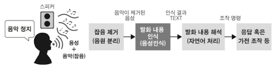
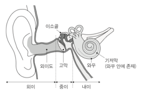
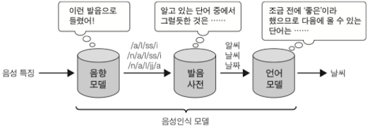
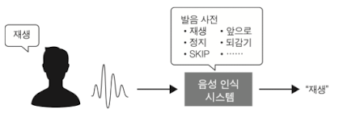
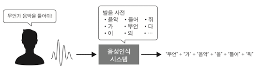

# 1 음성인식이란?

**speech recognition**(음성인식)은 음성 신호를 인식하는 기술을 통틀어 말한다.

사람이 음성을 인식하는 과정을 살펴보자. 우선 '소리'는 공기의 진동이다. 그러나 공기 진동이 직접 뇌에 전달되는 것은 아니며, 귀(청각 기관)에서 소리를 지각함으로써 얻은 신호가 전기 신호 형태로 뇌에 전달되어 소리를 인식하게 된다. 이 과정은 크게 지각 단계, 인식 단계로 구분된다.

- 지각 단계

    

    - 공기 진동은 외이도를 통해 고막을 흔든다.

    - 고막의 진동은 이소골에서 증폭되어 내이에 전달된다.

    - 내이에 있는 달팽이관 내 기저막 기관이 진동한다.

    - 소용돌이 형태의 기저막은, 음 높이(진동 주파수)에 따라 각각 다른 위치 진동한다. 좁은 바깥쪽은 고주파 진동, 넓은 안쪽은 저주파 진동에 공진한다.

    - 기저막의 진동은 기저막 위에 있는 유모 세포를 자극하고, 이 자극이 전기 신호로 변환되어 청각 신경을 통해 뇌(청각 피질)에 전달된다.

- 인식 단계

    갓난아기는 언어를 습득하지 못해 인식하지 못하지만, 학습하면서 점점 언어 능력이 향상되며 음성을 인식할 수 있게 된다.

---

## 1.1 기계의 음성인식

이러한 사람의 음성인식 단계를 기계에 대응시키면 지각 단계는 **특징 추출**, 인식 단계는 **기계 학습**에 해당된다.

- 특징 추출은 주로 **Fourier Transform**(푸리에 변환)을 이용한 주파수별 신호 처리 기법을 이용한다.

- 인식 단계는 기계 학습을 통해 얻은 음성인식 모델을 사용한다.

    

    - 음향 모델: 음성 특성과 음소열(모음/자음) 간 확률을 계산하는 모델

      > 이건 아(/a/)인가, 이(/i/)인가?

    - 발음 사전: 음소열과 단어 간의 관계를 다루는 모델

      > 단어와 발음의 관계 사전. 인사: /i/n/s/a/ 

    - 언어 모델: 문장에서 해당 단어가 발화될 확률 계산

      >앞의 단어가 '좋은'이라면 '날짜'보다는 '날씨'일 확률이 높을 것이다.

---

### 1.1.1 음성인식의 역사

- 음향 모델은 1980년대부터 2010년대까지 은닉 마코프 모델과, 혼합 정규분포 모델을 조합하여 구축했다. 

- 2010년부터는 딥러닝의 발전으로 혼합 정규분포를 딥러닝 모델로 전환하게 되었다.

- 2015년부터는 음향 모델, 발음 사전, 언어 모델을 하나의 딥러닝 모델로 표현하는 **End-to-End**(종단 간) 모델이 등장했다.

---

# 2 음성인식 기초 지식

## 2.1 확률

음성인식은 **확률**에 근거하여 발화 내용을 예측한다.

---

### &nbsp;&nbsp;&nbsp;📝 예제 1: 사전 확률&nbsp;&nbsp;&nbsp;

불투명한 자루 속에 검정 구슬, 흰 구슬이 여러 개 들어 있다.

- 자루에서 구슬을 1개 꺼내어 색을 기록하고 다시 자루에 넣는 작업을 100번 수행한 결과, 검정 75회, 흰색 25회였다.

다음에 꺼낼 구슬의 색의 사전 확률을 구하라.

### &nbsp;&nbsp;&nbsp;🔍 풀이&nbsp;&nbsp;&nbsp;

$$ P(y) = {{y} \over {시행 \, 횟수}} = {{75} \over {75 + 25}} = 0.75 $$ 

- $y$ : 검정 구슬

이처럼 **사전 확률**(prior probability)은 어떠한 추가 정보 없이 단순히 과거 결과만을 고려한 확률을 의미한다.

---

### &nbsp;&nbsp;&nbsp;📝 예제 2: 사후 확률(조건부 확률)&nbsp;&nbsp;&nbsp;

불투명한 자루 속에 검정 구슬 2개, 흰 구슬 2개가 들어 있다.

자루에서 꺼낸 첫 구슬이 검정인 경우, 이 구슬을 자루에 넣지 않고 다음 구슬을 꺼냈을 때 검정일 확률을 구하라.

### &nbsp;&nbsp;&nbsp;🔍 풀이&nbsp;&nbsp;&nbsp;

남은 구슬은 검정 구슬 1개, 흰 구슬 2개다.

$$ P(y|x) = {{1} \over {3}} = 0.333... $$ 

- $x$ : 조건(검정 구슬)

- $y$ : 사건(검정 구슬)

이처럼 **사후 확률**(조건부 확률, posterior probability)은 조건 $x$ 를 전제로 사건 $y$ 가 발생하는 확률을 의미한다.

> 음성인식은 "이런 음성이 입력되었다."는 사건을 관측 후 확률을 계산하는 문제이므로 **사후 확률 문제로 분류**한다.

---

### &nbsp;&nbsp;&nbsp;📝 예제 3: 동시 확률&nbsp;&nbsp;&nbsp;

자루에 검정 구슬 2개, 흰 구슬 2개가 있는 상태에서, 2개 구슬을 동시에 꺼내는 경우 모두 검정 구슬일 확률을 구하라.

### &nbsp;&nbsp;&nbsp;🔍 풀이&nbsp;&nbsp;&nbsp;

$$ P(x, y) = P(x)P(y|x) = {2 \over 4} \cdot {1 \over 3} = {1 \over 6} = 0.1666... $$ 

- $x$ : 사건(검정 구슬)

- $y$ : 사건(검정 구슬)

위 **동시 확률**은 사건이 일어날 사전 확률과, 사전이 있어났다는 전제로 두 번째 사건이 일어날 사후 확률의 곱으로 구할 수 있다. 이를 확률의 **연쇄 법칙**(chain rule)이라고 부른다.

$$ P(x,y) = P(x)P(y|x) = P(y)P(x|y) $$

위 식을 변형한 다음 관계식을 **베이즈 정리**(Bayes' theorem)라고 부른다.

$$ P(y|x) = {{P(x|y)P(y)} \over {P(x)}} $$

---

### &nbsp;&nbsp;&nbsp;📝 예제 4: 확률의 주변화&nbsp;&nbsp;&nbsp;

자루에 검정 구슬 2개, 흰 구슬 2개가 있는 상태에서, 2개 구슬을 동시에 꺼내는 경우 모두 검정 구슬일 확률이거나 검은 구슬+흰 구슬일 확률을 구하라.

### &nbsp;&nbsp;&nbsp;🔍 풀이&nbsp;&nbsp;&nbsp;

$$ P(x, y) + P(x, y') = {2 \over 4} \cdot {1 \over 3} + {2 \over 4} \cdot {2 \over 3} = {2 \over 4}({1 \over 3} + {2 \over 3}) = {2 \over 4} = 0.5 $$ 

- $x$ : 사건(검정 구슬)

- $y$ : 사건(검정 구슬)

- $y'$ : 사건(흰 구슬)

위처럼 일부 조건에서의 동시 확률을 모두 합산한 결과는, 자루에서 구슬 1개를 꺼낼 때 $x$ 가 검정 구슬일 확률과 동등하다. 이를 **확률의 주변화**(marginalization of probability)라고 한다.

$$ \sum_{y}P(x,y) = P(x) $$

$$ \sum_{x}P(x,y) = P(y) $$

---

### 2.1.1 베이즈 정리의 예시

예제 3에서 본 베이즈 정리를 조금 더 살펴보자. 

- 과거 어떤 질병 $x$ 를 앓았던 사람에게 또 다른 질병 $y$ 가 발병할 확률 $P(y|x)$

- $x$ 와는 다른 질병 $x'$ 혹은 $x''$ 을 앓는 사람에게 또 다른 질병 $y$ 가 발병할 확률

위 세 가지 케이스를 모두 재조사한다면 조사 비용이 많이 소요될 것이다. 그렇다면 반대로 $P(x|y)$ , $P(x'|y)$ , $P(x''|y)$ 를 조사한다면, 오직 $y$ 를 걸린 사람만 모아서 한 번에 조사를 마칠 수 있다.

정리하자면 "과거에 발생한 사건( $x, x', x''$ )과 그 이후 결과( $y$ )"의 정보를 기반으로, "현재 사건이 발생하는 확률"을 역으로 구할 수 있는 것이다.

이러한 베이즈 정리에 의거하여 음성인식 문제를 정의한다.

---

## 2.2 음성인식 문제 정의

음성인식 문제를 수식으로 정의해 보자. 음성 $x$ 를 입력으로 삼아 가장 확률이 높은 텍스트를 출력할 것이다.

$$ \hat{w} = \underset{w}{\mathrm{argmax}}P(w|x) $$

- $x$ : 입력 음성(시계열 데이터)

- $w$ : 텍스트 후보

- $\hat{w}$ : 예측 결과

위 수식을 베이즈 정리를 이용해 다음과 같이 변형할 수 있다.

$$ \hat{w} = \underset{w}{\mathrm{argmax}}{{P(x|w)P(w)} \over {P(x)}} $$

- $P(x|w)$ : 텍스트 $w$ 를 발화했을 때 녹음된 음성이 $x$ 일 확률

- $P(w)$ : 텍스트 $w$ 가 발화될 확률

  > 다시 말해 얼마나 빈번하게 발화되는지 나타내는 사전 확률

- $P(x)$ : 모든 $w$ 에 대해 동일한 값을 가지고 있다. **즉, 계산할 필요가 없다.**

따라서 $P(x)$ 를 무시하여 식을 정리할 수 있다.

$$ \hat{w} = \underset{w}{\mathrm{argmax}}{P(x|w)P(w)} $$

이러한 수식을 풀기 위해 $P(x|w)$ 을 계산하는 모듈을 **음향 모델**이라고 부른다. 텍스트/음성 쌍으로 구성된 대량의 데이터를 기반으로 학습한다.

---

## 2.3 텍스트 종류와 발음 사전

텍스트 $w$ 는 다양한 방식으로 요소를 나눌 수 있다.

$w$ = "오늘은 좋은 날씨네요."

- 단어 단위: $w(0)$ = "오늘", $w(1)$ = "은", $w(2)$ = "좋은", $w(3)$ = "날씨", $w(4)$ = "네", $w(5)$ = "요"

- 문자 단위(character): $w(0)$ = "오", $w(1)$ = "늘", $w(2)$ = "은", $w(3)$ = "좋", ...

우선 $P(x|w)$ 를 구할 때 텍스트 $w$ 를 단어로 정의할 경우, 모든 단어 $w$ 와 알맞는 음성 데이터 $x$ 를 모아야 할 것이다. 모든 학습용 음성 데이터가 없다면, 없는 단어는 인식할 수 없기 때문이다.

이처럼 음성 데이터에 존재하지 않는 단어를 인식하기 위해서, $P(x|w)$ 를 더욱 작은 단위의 **음소 모델**(sub-word model)로 불리는 음향 모델과, **발음 사전** 모듈로 구성하는 방법을 일반적으로 사용한다.

단어는 음소의 배열로 이루어져 있으므로, 음소의 배열 $p$ 를 수식에 추가하여 변형시킬 수 있다.(**확률 주변화** 이용)

$$ \underset{w}{\mathrm{argmax}}{P(x|w)P(w)} = \underset{w}{\mathrm{argmax}}\sum_{p}{P(x, p|w)P(w)} $$

- $P(x|w)$ : 텍스트 $w$ 가 주어졌을 때, 음소 배열이 $p$ 일 확률. 이를 **발음 사전**이라 한다.

  > 확률이라고는 하나, 일반적으로 사전 정의와 일치하면 1.0, 일치하지 않으면 0.0으로 정의한다.

또한 연쇄 법칙을 적용하면 다음과 같이 표현할 수 있다.

$$ = \underset{w}{\mathrm{argmax}}\sum_{p}{P(x|p)P(p|w)P(w)} $$

> 우변의 $P(x|p)$ 는 원래 연쇄 법칙에 따라서는 $P(x|w)$ 로 표기되지만, 텍스트 $w$ 를 구성하는 음소의 배열 $p$ 를 관측하면 동시에 $w$ 도 관측되기 때문에 $p$ 만을 고려한다.

그러나 실제 음성인식 시스템에서는 "발화 가능한 모든 발음의 합"을 구하기보다, 가장 확률이 높은 발음에 근사하여 모델링한다.

$$ \underset{w}{\mathrm{argmax}}{P(x|w)P(w)} \approx \underset{w}{\mathrm{argmax}}\lbrace{\underset{p}{\max} P(x|p)P(p|w)P(w)}\rbrace $$

---

## 2.4 음성인식 문제의 종류

음성인식 문제는 크게 두 종류로 분류된다. 하나는 **고립단어 인식**(isolated word recognition), 다른 하나는 **연속 음성인식**(continuous speech recognition)이다.

---

### 2.4.1 고립단어 인식

단일 단어 단독으로 발화되는 음성을 예측하는 문제다.

- 발음 사전에 존재하지 않는 단어는 인식할 수 없다.

- 단어만이 아니라 "조명 ON"과 같은 문구도 발음 사전에 등록할 수 있다.

언제나 발음 사전에 등록된 단어가 예측 결과로 나오기 때문에, 언제나 **모든 정답은 1/(발음 사전 어휘 수) 확률**을 갖게 된다.(= $P(w)$ ) 따라서 수식에서 $P(w)$ 를 고려하지 않아도 된다.

$$ \hat{w} = \underset{w}{\mathrm{argmax}}{P(x|w)P(w)} $$

$$ \quad \quad \quad \quad \, = \underset{w}{\mathrm{argmax}} \lbrace \underset{p}{\max}{P(x|p)P(p|w)} \rbrace $$

---

### 2.4.2 연속 음성인식

연속 음성인식은 2.3절에서 정의한 수식이 그대로 적용된다.

$$ \hat{w} = \underset{w}{\mathrm{argmax}}{P(x|w)P(w)} $$ 

$$ \quad \quad \quad \quad \quad \quad \quad \approx \underset{w}{\mathrm{argmax}}\lbrace{\underset{p}{\max} P(x|p)P(p|w)P(w)}\rbrace $$

---