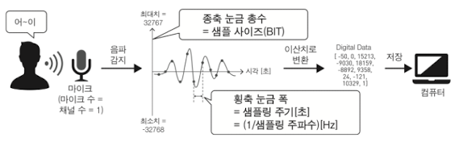
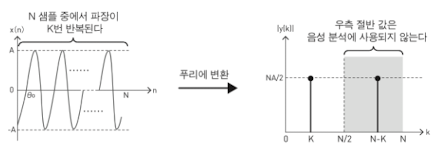
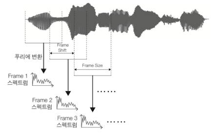
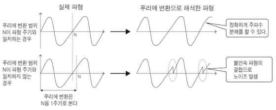
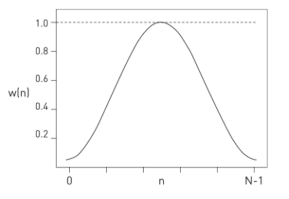
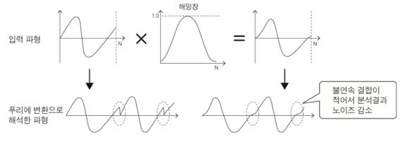

# 3 음성 처리 기초와 특징 추출

## 3.1 데이터 준비하기

> [JSUT 코퍼스 데이터셋 다운로드](https://sites.google.com/site/shinnosuketakamichi/publication/jsut)

> [교재 깃허브](https://github.com/bjpublic/python_speech_recognition)

실습을 위한 음성 데이터는 JSUT 코퍼스[Sonobe 2017] 데이터셋을 사용할 것이다.(일본어 음성 데이터셋)

깃허브 코드를 다운로드한 뒤, 다음 명령을 실행하면 데이터셋 다운로드, 다운샘플링, 라벨링까지 완료할 수 있다.

```bash
# 데이터셋 다운로드
# data/original에 저장된다.
$ python 00prepare/00download_data.py

# 16kHz 다운샘플링("sox" 소프트웨어 사용)
# 다운샘플링된 파일은 data/wav에 저장된다.
# 음성 파일 목록은 data/label/all/wav.scp에 저장된다.
$ python 00prepare/01prepare_wav.py

# 라벨링
# 발화별로 내용을 추출하여 문자 단위, 히라가나 단위, 음소 단위로 라벨링한다.
$ python 00prepare/02prepare_label.py

# 데이터 분리
# 학습 데이터 대/소, 개발 데이터, 평가 데이터로 분리한다.
$ python 00prepare/03subset_data.py
```

코드 실행이 끝나면 다음과 같이 디렉터리 구조가 만들어진다.

```
work/
└──data/
│   ├──original/: original 데이터넷
│   ├──wav/     : 16kHz 다운 샘플링 버전
│   └──label/   : subset별 텍스트 및 음성 데이터 라벨
│        ├──all         : 전체 데이터
│        ├──train_small : 학습 데이터 소
│        ├──train_large : 학습 데이터 대
│        ├──dev         : 개발 데이터
│        └──test        : 평가 데이터
└──00prepare/
```

JSUT 원본 데이터셋은 48kHz 샘플링 주파수로 녹음되어 있다. 샘플링 주파수란 1초동안의 음성 음압치를 의미하며, 48kHz의 경우 1초 동안 음압치 48,000회를 기록했다는 뜻이다.

- 샘플링 주파수가 클수록 정보량이 많지만, 일반적으로는 16kHz 음성을 사용한다.(전화 음성의 경우 8kHz를 쓰기도 한다.)

잠시 다운샘플링 후 저장된 음성 파일 목록("data/label/all/wav.scp") 파일을 살펴보자.

```
#   발화 ID    |               파일 경로
BASIC5000_0001 /home/work/data/wav/BASIC5000_0001.wav
BASIC5000_0002 /home/work/data/wav/BASIC5000_0002.wav
...
BASIC5000_5000 /home/work/data/wav/BASIC5000_5000.wav
```

> 0001\~0250: 평가 데이터, 0251\~0500: 개발 데이터, 0501\~5000: 학습 데이터

> 학습 데이터 소는 0501\~1500만을 사용하고(검증 목적), 학습 데이터 대는 0501\~5000 전부를 사용한다.

그 다음은 원본 데이터셋을 다운로드받으며 함께 제공되는 yaml 파일(data/original/just-label-master/text-kana/basic5000.yaml)을 바탕으로, 라벨링을 적용한 결과물을 살펴보자.(data/label/all/text_char, text_kana, text_phone)

```
# text_char
# BASIC5000_0001 "물은 말레이시아에서 구매해야 합니다." 문장을 문자 단위로 라벨링
BASIC5000_0001: 미즈 오 마 레 - 시 아 카 라 카 와 나 쿠 테 와 나 라 나 이 노 데 스
```

```
# text_kana
# BASIC5000_0001 "물은 말레이시아에서 구매해야 합니다." 문장을 히라가나 단위로 라벨링
BASIC5000_0001: 미 즈 오 마 레 - 시 아 카 라 카 와 나 쿠 테 와 나 라 나 이 노 데 스
```

```
# text_kana
# BASIC5000_0001 "물은 말레이시아에서 구매해야 합니다." 문장을 음소 단위로 라벨링
BASIC5000_0001: m i z u o m a r e e sh i a k a r a w a n a k u t e w a n a r a n a i n o d e s u
```

---

## 3.2 음성 파일 읽어보기

음성 파일은 여러 종류가 있는데 대표적으로 `wav`, `mp3` 형식이 있다.  `mp3` 원시 음성 파일을 압축하여 기록하는 "압축 음성", `wav`는 대체로 압축하지 않는 "비압축 음성"에 해당된다.

> 음성인식 시스템에서는 정보 손실이 없는 비압축 음성을 선호한다.



- 마이크 수 = **채널 수**

    채널 수가 1인 음성을 모노 음성, 채널 수가 2인 음성을 스테레오 음성으로 부른다. 음성 인식에서는 주로 모노 음성을 사용한다.

    > 모노 음성에서 x축은 시간, y축은 음향을 의미한다.

- 마이크에서 감지되는 음성은 연속적인 값(연속치)을 갖는다. 이를 디지털 시계가 일정 간격으로 샘플링하여 이산치로 바꾸게 된다.

   - 샘플링하는 간격을 **샘플링 주기**[s]라고 한다.
   
   - 샘플링 주기의 역수를 **샘플링 주파수**[Hz]라고 하며, 1초 동안 몇 개의 음압치를 샘플링하는지 나타낸다.

  > 예를 들어 CD 음원은 고품질 음을 기록하기 위해 44,100Hz라는 비교적 높은 샘플링 주파수를 사용하나, 휴대전화는 통신량을 줄이기 위해 8,000Hz라는 낮은 샘플링 주파수를 사용한다.

- y축(음향 방향)도 이산치로 변환해야 한다. 이를 양자화라고 하며 눈금 개수를 **샘플링 사이즈**[bit] 혹은 **비트 심도**라고 부른다.

  > 샘플링 사이즈는 주로 8, 16, 24, 32비트 중 하나를 사용하며, 일반적으로는 16bit를 제일 많이 쓴다.

  > $2^{16} = 65,536$ 이므로, 눈금 개수는 65,536개를 갖고 최대치는 32,767, 최소치는 -32,768이 된다.

Python에서 제공하는 wave 라이브러리를 사용하면 wav 파일이 갖는 위 정보를 확인할 수 있다. 또한 matplotlib를 함께 사용한다면 음성 파형의 시각화까지 가능하다.

---

## 3.3 푸리에 변환을 이용한 주파수 분해

> [3Blue1Brown youtube: 푸리에 변환이 대체 뭘까요? 그려서 보여드리겠습니다.](https://youtu.be/spUNpyF58BY)

시간 신호를 주파수별 신호로 분해하는 대표적인 방법으로 **푸리에 변환**(Fourier transform)이 있다. "모든 주기적인 신호는 주파수가 다른 삼각함수의 조합으로 표현할 수 있다"는 원리에 따른다. 

- 연속적인 시간 신호를 연속치인 주파수 축으로 분해하는 연속 푸리에 변환

- 이산치 시간 신호를 이산치 주파수 축으로 분해하는 이산 푸리에 변환

컴퓨터는 이산치를 사용하므로 이산 푸리에 변환을 살펴보자.

$$ y(k) = {\sum}_{n=0}^{N-1}x(n)e^{-j{{2\pi n k} \over {N}}} $$

- $x(n)$ : 시각이 $n$ 일 때 시간 신호 $x$ 의 값(음압치)

- $N$ : 분석 구간 내 샘플 수

- $y$ : $x$ 를 주파수 성분에 따라 분해한 결과값

- $k$ : 0\~N-1 (1주기) 동안의 주파수 값

    > 예를 들어 y(k=1): 0\~N-1 범위 한 바퀴를 채운 파장 값, y(k=2)는 두 바퀴, 즉 y(k=1)의 2배 주파수를 가진 파장 값이다.

이러한 스펙트럼 $y$ 를 시간 신호 $x$ 로 복원하는 처리를 **역이산 푸리에 변환**이라 한다.

$$ x(n) = {{1}\over{N}}{\sum}_{n=0}^{N-1}y(k)e^{j{{2\pi n k} \over {N}}} $$

푸리에 변환을 시각화하면 다음과 같다.



- 진폭 스펙트럼은 좌우대칭이므로, 좌측 절반만 사용한다.

  - 스펙트럼의 x축 최댓값은 샘플링 주파수/2이다.

  - 따라서 특정 주파수의 시간 파형을 기록하기 위해서는, 해당 값에 2배를 적용한 샘플링 주파수를 사용해서 기록해야 한다. 이를 **샘플링 정리**라고 한다.

  - 다시 말해 샘플링 주파수 16,000Hz로 기록한 음성은, 8,000Hz 이상의 주파수를 포함하지 못한다. 이러한 상한값을 **나이퀴스트 주파수**라고 한다.(위 그림의 N/2)

그러나 진폭 스펙트럼은 흔들리는 폭이 너무 커서, 시각화를 하여 세부 구조를 관찰하기 힘들다. 따라서 로그를 씌운 로그 진폭 스펙트럼을 사용해서 시각화 및 분석한다. 

- 단 값이 0이면 로그가 마이너스 무한대가 되므로, 처리 결과에 영향을 미치지 않는 작은 값을 더하여 로그를 적용한다. 이를 **플로어링 처리**라고 한다.

> 이외 이산 푸리에 변환을 빠르게 처리하는 **고속 푸리에 변환**(Fast Fourier Transform, FFT)도 있다. numpy의 `fft` 함수로 사용할 수 있다.

---

## 3.4 단시간 푸리에 변환

그러나 푸리에 변환으로 얻은 진폭 스펙트럼의 x축은 주파수이므로 시간과 관련된 정보는 알 수 없다. 

- 따라서 짧은 시간대의 음성("안", "녕", "하",...)만을 추출하여 푸리에 변환을 적용하여, 시간 변화에 따른 정보도 표현하는 접근법을 취할 수 있다. 

- 이를 **단시간 푸리에 변환**(Short-time Fourier transform, STFT)이라 한다.



- 짧게 쪼개진 구간 단위로 추출된 데이터를 **프레임**(frame)이라 한다.

  프레임과 프레임 사이가 겹치는 정도를 overlap이라 부른다. 음성은 연속적이기 때문에 어느 정도 오버랩을 도입해야 시간적인 변화를 세밀하게 포착할 수 있다.

  - 프레임 폭을 **프레임 사이즈**, 프레임 간격을 **프레임 시프트** 혹은 프레임 간격이라 한다.

그러나 푸리에 변환을 적용하기 전에 **창 함수**(window function)을 만들어야 한다. 푸리에 변환은 분석을 1주기 단위로 하기 때문에, 이러한 파형 주기를 정확하게 분리할 함수가 필요한 것이다.



- 아래와 같이 푸리에 변환 범위 $N$ 가 파형 주기와 일치하지 않으면, 주파수 분해 결과에 노이즈가 발생한다.

분석 대상의 파형 주기를 미리 알고 분석을 진행할 수는 없으므로, 일반적으로는 파형 주기와 일치하지 않는 분석 구간으로 푸리에 변환이 적용된다. 이때 창 함수는 파장 경계선에 존재하는 불연속성이 눈에 띄지 않게 만드는 역할을 한다.

아래는 대표적인 **해밍 창**(Hamming window) 함수를 나타낸 수식과 그림이다.

$$ w(n) = 0.54 - 0.46 \cos \left({{2\pi n} \over {N-1}}\right) $$



- 0과 N-1에 가까울수록 0에 가까운 값을 갖는다.

  따라서 분석 구간의 파장 주기가 일치하지 않더라도, 파장 경계선에 존재하는 불연속성이 눈에 띄지 않게 된다.

    

---